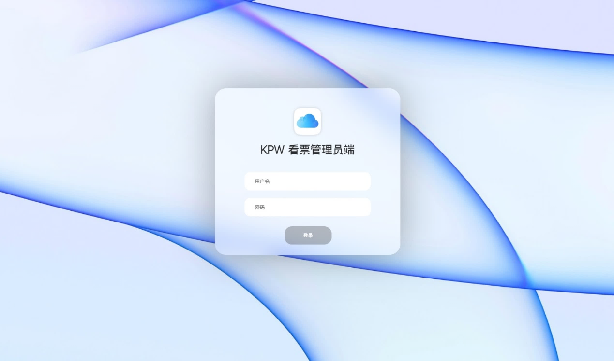

<h1 align="center">
 看票Kanpiao - 管理后台
</h1>
<h3 align="center">一个运行在小程序的票务系统的后台</h3>
<p align="center">

</p>
**看票Kanpiao-管理后台**使用PHP开发，并通过Web渲染UI。此后台系统为管理员提供了对用户、订单、演出和场次的全面管理功能。

用户、检票员端，请见[kanpiao](https://github.com/hankzhangcn/kanpiao)

## 功能模块

- **用户管理**：管理注册用户的相关信息。

- **订单管理**：查看和管理所有订单，跟踪购票情况。

- **演出管理**：添加、修改、删除演出信息。

- **场次管理**：为每个演出管理不同场次的安排。

  

## 快速开始

### 先决条件

- PHP环境（如Apache或Nginx服务器）。
- MySQL数据库用于存储管理系统数据。
- 基本的Web服务器配置。

### 安装步骤

1. 克隆此仓库到你的服务器目录：

   ```bash
   git clone git@github.com:hankzhangcn/kanpiao-web.git
   ```

1. 配置服务器环境，确保PHP和MySQL正常运行。

1. 根据你的服务器环境配置PHP，设置数据库连接等信息。

1. 访问服务器上的项目地址，开始使用后台管理系统。

## 特别说明

**数据库文件未归档**

项目中的数据库文件尚未归档。你需要自行设置数据库结构，或根据项目代码中的需求手动创建数据库表。部分表设计参考 [Sql_expl.md](Sql_expl.md) 。

## 参与贡献

欢迎提交Pull Request或提出Issue，帮助我们改进后台系统。

## 许可证

本项目基于MIT许可证开源。
